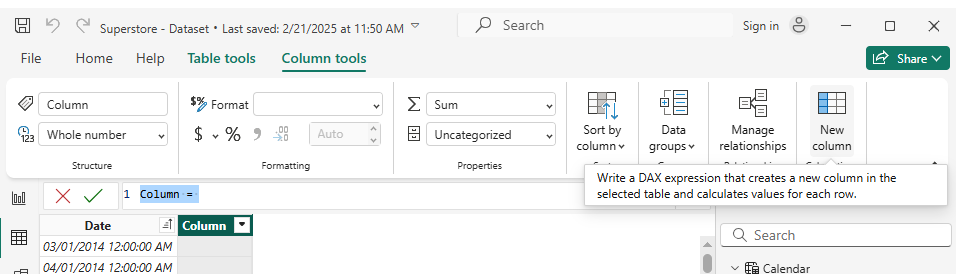
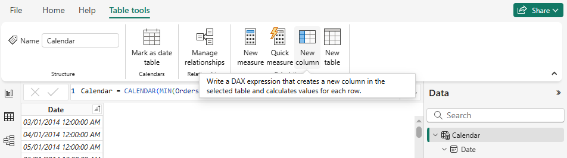
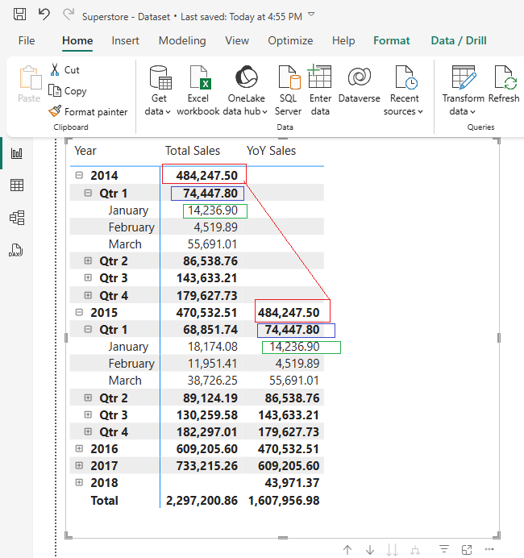

# ⏳ Time Intelligence in Power BI

Time Intelligence in Power BI refers to a set of **DAX (Data Analysis Expressions)** functions that enable users to perform **time-based calculations** efficiently. These functions help analyze trends, compare periods, and calculate cumulative values over time, making them essential for financial, sales, and operational reporting.

---


## ✅ Prerequisites for Time Intelligence Functions
To use **Time Intelligence functions** effectively, you need:
1. A **continuous Calendar Table** that spans the required time range.
2. The date table must be **marked as a Date Table** in Power BI.
   - ✅ Select the table
   - ✅ Click **"Mark as Date Table"** in the **Modeling** tab.


---

## 🛠️ Steps to Create a Calendar Table

### 📌 1. Create a New Table in Power BI
Use the following **DAX formula** in the **Modeling** tab by selecting **New Table**:

#### 🟢 A. Using `CALENDARAUTO()`
⚠️ **`CALENDARAUTO()`** does not provide a built-in way to exclude specific date columns from the dataset. It automatically scans all date columns and determines the **minimum and maximum dates** to generate a continuous date range.

```DAX
Calendar = CALENDARAUTO()
```

#### 🟢 B. Using `CALENDAR()`
You can **manually define** the start and end dates using:

✅ **Fixed Date Range:**
```DAX
Calendar = CALENDAR(DATE(2020,1,1), DATE(2030,12,31))
```

✅ **Dynamic Min/Max Dates from Dataset:**
```DAX
Calendar = CALENDAR(MIN(Orders[Order Date]), MAX(Orders[Ship Date]))
```

After creating a **Calendar Table**, you can add **calculated columns** to extract specific date-related attributes.

---

## 📷 Adding Custom Columns (Screenshots)

<table border="1" style="border-collapse: collapse; width: 100%;">
  <tr>
    <td style="text-align: center;">
      
    </td>
  </tr>
  <tr>
    <td style="text-align: center; background: #eaeaea; font-weight: bold;">You can also find new columns as shown below:</td>
  </tr>
  <tr>
    <td style="text-align: center;">
      
    </td>
  </tr>
</table>

---

## 🔧 Define Custom Columns
✅ **Create new columns for each required format:**

```DAX
Qtr-year = "Qrt " & FORMAT('Calendar'[Date],"Q-yyyy")
```
```DAX
W-Num-Year = WEEKNUM('Calendar'[Date])
```
```DAX
Day-Month = DAY('Calendar'[Date])
```
```DAX
Special-date = "Month " & FORMAT('Calendar'[Date], "MM-YYYY")
```
```DAX
W-Num-Month = ROUNDDOWN((day('Calendar'[Date])-1)/7,0)+1
```
```DAX
Fiscal-Qtr = if(QUARTER('Calendar'[Date])>2, -- Most Fiscal Q starts on Qrt 3
    QUARTER('Calendar'[Date])-2,
    QUARTER('Calendar'[Date])+2)
```
```DAX
Fiscal-Y = if(QUARTER('Calendar'[Date])>2,
     YEAR('Calendar'[Date]) &"-" &YEAR('Calendar'[Date])+1,
     YEAR('Calendar'[Date])-1 &"-" &YEAR('Calendar'[Date]))
```

✅ **Or create all in one table:**
```DAX
Calendar = 
ADDCOLUMNS(
    CALENDAR(DATE(2020,1,1), DATE(2030,12,31)),
    "Year", YEAR([Date]),
    "Month", FORMAT([Date], "MMMM"),
    "Month Number", MONTH([Date]),
    "Quarter", "Q" & FORMAT([Date], "Q"),
    "Weekday", FORMAT([Date], "dddd"),
    "Weekday Number", WEEKDAY([Date], 2), -- Monday = 1
    "Year-Month", FORMAT([Date], "YYYY-MM"),
    "Year-Quarter", FORMAT([Date], "YYYY") & "-Q" & FORMAT([Date], "Q"),
    "Day of Year", DATEDIFF(DATE(YEAR([Date]), 1, 1), [Date], DAY) + 1
)
```
***Explanation of above code***
- **Date**: The base date range from 2020 to 2030 (adjust as needed).
- **Year**: Extracts the year.
- **Month**: `MMMM` Full month name (e.g., January), `MMM` first 3 letters (e.g., Jan), and `MM` in number within the year (e.g., 01) 
- **Month Number**: Numeric representation of the month.
- **Quarter**: Quarter of the year (Q1, Q2, etc.).
- **Weekday**: Full day name (e.g., Monday), `ddd` first 3 letters (e.g., Mon), and `dd` in number within the month (e.g., 06).
- **Weekday Number**: Numeric representation of the weekday (Monday as 1). number within the week.
- **Year-Month**: Concatenation of year and month for easier filtering.
- **Year-Quarter**: Concatenation of year and quarter.
- **Day of Year**: Day number within the year.
---

## ✅ Best Practices
- 📌 Ensure the Calendar table has a **relationship with the fact table** using the `Date` column.
- 📌 **Mark the table as a Date Table** in Power BI (**Modeling** → **Mark as Date Table**).
- 📌 Add additional columns like **Fiscal Year or Holidays** if needed.
- 📌 When using **Month or Day in numbers**, it's better to use **`MM` or `dd`** for **better sorting** in dashboards.
- 📌 Adjust the **`CALENDAR`** function range based on your data requirements.
- 📌 Add more columns for **fiscal periods, holidays, or ISO weeks** as needed.

---


## 📌 Key Features of Time Intelligence

The total summary can be calculated using the following DAX expression:

```DAX
Total Sales = SUM(Orders[Sales])
```
Once the **Total Sales** measure is defined, various **time intelligence functions** can be applied to perform advanced date-based analysis.


### 🔄 1. Period Comparisons
These functions allow you to compare data from different time periods, such as:
- 📊 Year-over-Year (YoY), Month-over-Month (MoM), and Week-over-Week (WoW) comparisons.

✅ **Example: Year-over-Year Sales Comparison**
```DAX
YoY Sales = CALCULATE(SUM(Sales[Amount]), SAMEPERIODLASTYEAR(Calendar[Date]))
```
This formula calculates the total sales for the same period in the previous year.


---

### 📈 2. Cumulative Aggregations
You can calculate cumulative values like **running totals** or **year-to-date (YTD), quarter-to-date (QTD), and month-to-date (MTD)** values.

✅ **Example: Year-to-Date (YTD) Sales Calculation**
```DAX
Sales YTD = TOTALYTD(SUM(Sales[Amount]), Calendar[Date])
```
This formula accumulates sales from the beginning of the year to the current date.

---

### 📊 3. Moving Averages
Moving averages smooth out trends over a rolling period to identify long-term patterns.

✅ **Example: 30-Day Moving Average of Sales**
```DAX
Moving Average = AVERAGEX(DATESINPERIOD(Calendar[Date], MAX(Calendar[Date]), -30, DAY), [Total Sales])
```
This calculates the **average sales for the last 30 days**, helping to track trends over time.

---

### 🔀 4. Shifting Time Periods
These functions allow comparisons with previous periods, such as the **previous month or previous quarter**.

✅ **Example: Previous Month Sales Calculation**
```DAX
Previous Month Sales = CALCULATE(SUM(Sales[Amount]), PREVIOUSMONTH(Calendar[Date]))
```
This formula retrieves the total sales for the **previous month**.

---

### 🗓️ 5. Custom Fiscal Calendars
If your organization follows a **fiscal year** instead of a calendar year, you can create custom calculations based on your fiscal periods.

✅ **Example: Fiscal Year-to-Date Calculation**
```DAX
Fiscal YTD Sales = TOTALYTD(SUM(Sales[Amount]), Calendar[Date], "06-30")
```
This formula calculates YTD sales, assuming the **fiscal year ends on June 30th**.

---

## 🎯 Conclusion
A well-structured **Calendar Dimension table** enhances **time-based analysis** and allows for **efficient filtering and calculations** in Power BI reports.

🚀 **Optimize your reports by implementing these Time Intelligence functions today!**
