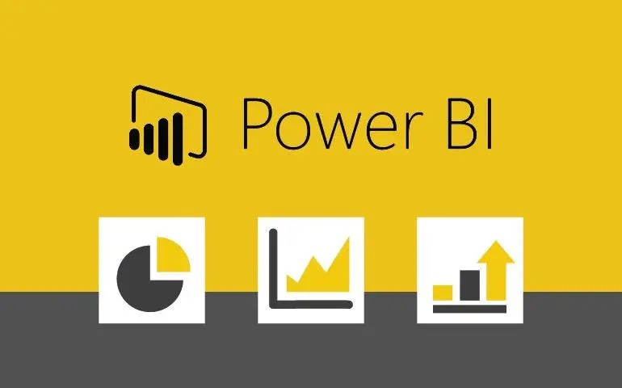
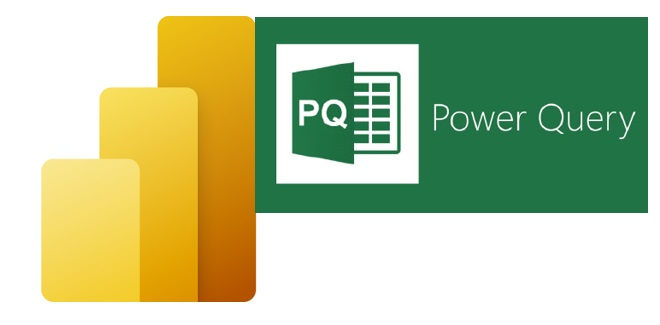

# Power BI Tricks & Highlights
Welcome to the Power BI Tricks & Highlights repository! 🎉

<table border="1" style="border-collapse: collapse; width: 100%;">
  <tr>
    <td>
      
      
<em> Mahmoud Yusuf</em>

    </td>
    <td>
      
    </td>
  </tr>
</table>

This repository is a one-stop resource for:
- **Power Query**: Data transformation tips and advanced techniques.
- **DAX**: Dynamic calculations and performance optimization tricks.
- **Visualizations**: Design and interaction tips for creating impactful dashboards.

## Repository Structure
- **PowerQuery/**: Tips and tricks for data preparation using Power Query.
- **DAX/**: Learn how to write efficient and dynamic formulas.
- **Visualizations/**: Enhance your reports with impactful visuals and design techniques.
- **Sample-Files/**: Example `.pbix` files and datasets to practice and explore.

## How to Use
1. Browse through the folders to find tips and tricks for your needs.
2. Check out the sample `.pbix` files in the `Sample-Files` folder.
3. Learn, practice, and share your feedback!

## Contribute
Have a trick or tip to share? We welcome contributions! Submit an issue or a pull request.

## Stay Updated
Bookmark this repository and watch for updates as we continuously add new tricks.
